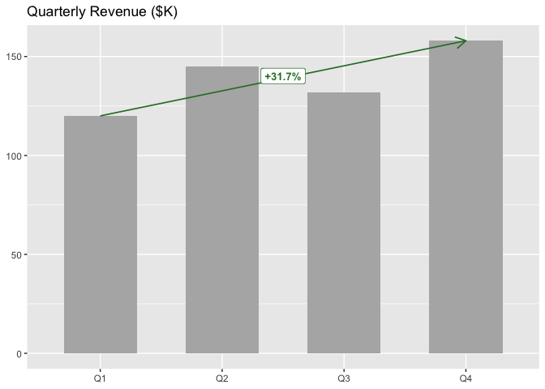

<!-- README.md is generated from README.Rmd. Please edit that file -->

# ggmemo

<!-- badges: start -->

<!-- badges: end -->

ggmemo provides semantic, opinionated annotation helpers for business
charts built with ggplot2. Instead of manually computing deltas,
formatting percentages, and fiddling with arrow coordinates, you call
high-level verbs like `annotate_callout()` and `annotate_change()` that
handle the details for you. Built on top of the
[ggpp](https://docs.r4photobiology.info/ggpp/) package for precise
annotation positioning.

## Installation

You can install the development version of ggmemo from
[GitHub](https://github.com/) with:

``` r
# install.packages("pak")
pak::pak("lindsay-lintelman/ggmemo")
```

## Examples

### Callout annotation

Point at a specific data row with an arrow and label — one line of
ggmemo code instead of manual arrow and label coordinates:

``` r
library(ggplot2)
library(ggmemo)

ggplot(economics, aes(x = date, y = unemploy)) +
  geom_line() +
  annotate_callout(
    economics,
    where = date == as.Date("2009-10-01"),
    label = "Peak unemployment",
    position = "bottom-left"
  ) +
  labs(
    title = "U.S. Unemployment (thousands)",
    x = NULL, y = NULL
  )
```


### Change annotation

Show the delta between two data points with a color-coded arrow and
auto-formatted label:

``` r
quarterly_revenue <- data.frame(
  quarter = factor(c("Q1", "Q2", "Q3", "Q4"),
                   levels = c("Q1", "Q2", "Q3", "Q4")),
  revenue = c(120, 145, 132, 158)
)

ggplot(quarterly_revenue, aes(x = quarter, y = revenue)) +
  geom_col(fill = "grey70", width = 0.6) +
  annotate_change(
    quarterly_revenue,
    from = quarter == "Q1",
    to = quarter == "Q4",
    value = revenue
  ) +
  labs(
    title = "Quarterly Revenue ($K)",
    x = NULL, y = NULL
  )
```


