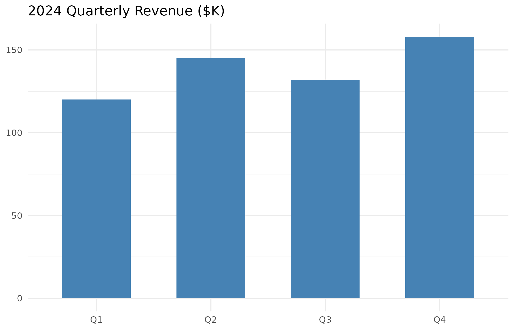
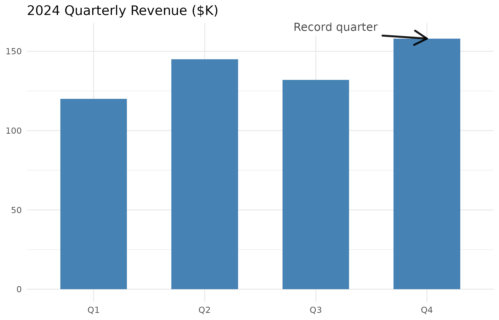
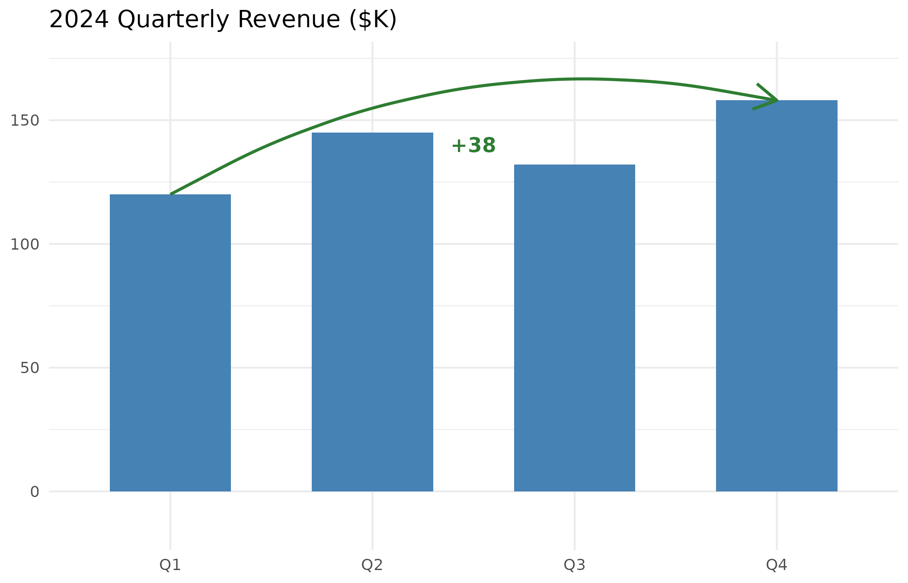
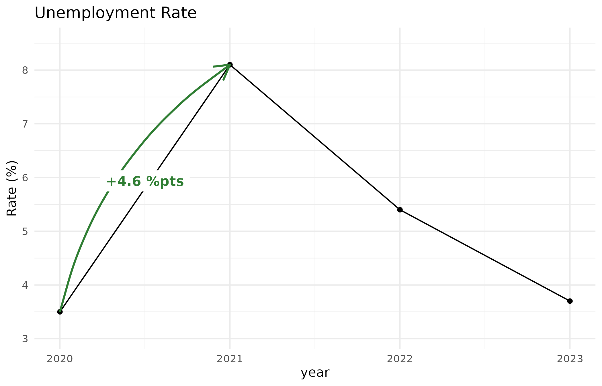
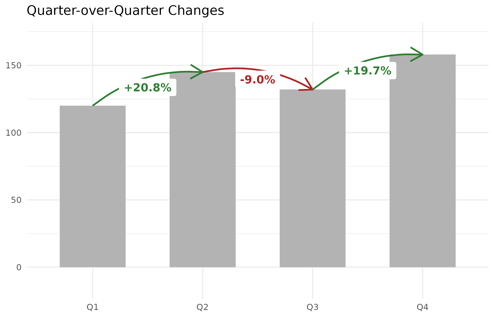
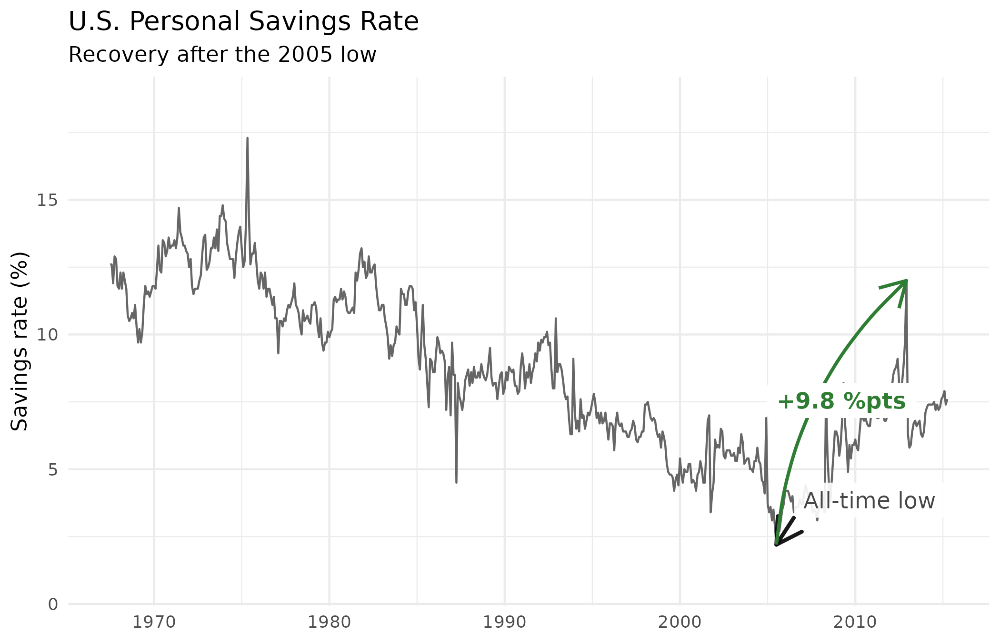
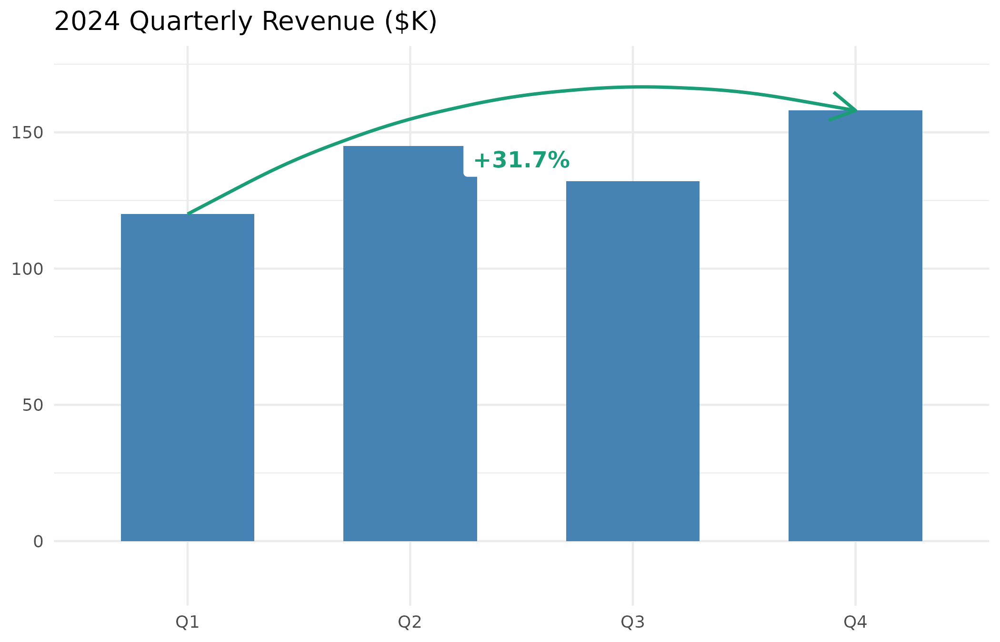
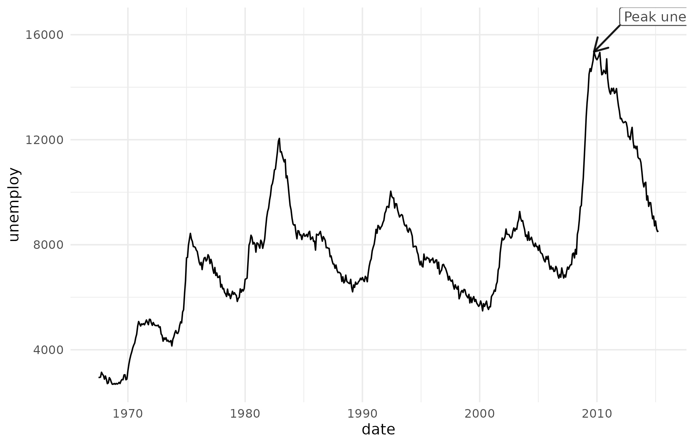

# Narrating Business Charts with ggmemo

A ggplot2 chart shows data. An annotated chart tells a story — it
directs the reader’s attention to the data points that matter and
quantifies what changed. ggmemo adds that storytelling layer with two
functions:

- [`annotate_callout()`](https://lindsay-lintelman.github.io/ggmemo/reference/annotate_callout.md)
  points at a data row with an arrow and label.
- [`annotate_change()`](https://lindsay-lintelman.github.io/ggmemo/reference/annotate_change.md)
  draws a color-coded arrow between two rows and labels the delta.

Both return standard ggplot2 layers that you add to a plot with `+`.

This vignette walks through a quarterly revenue dataset from a bare
chart to a fully narrated one.

## The data

``` r

library(ggplot2)
library(ggmemo)

revenue <- data.frame(
  quarter = factor(c("Q1", "Q2", "Q3", "Q4"),
                   levels = c("Q1", "Q2", "Q3", "Q4")),
  revenue = c(120, 145, 132, 158)
)
```

## A chart without annotations

This bar chart is accurate, but it doesn’t guide the reader. Which
quarter matters? Is the trend good or bad? The viewer has to figure that
out on their own.

``` r

p <- ggplot(revenue, aes(x = quarter, y = revenue)) +
  geom_col(fill = "steelblue", width = 0.6) +
  labs(title = "2024 Quarterly Revenue ($K)", x = NULL, y = NULL) +
  theme_minimal()
p
```



## Calling out a key data point

[`annotate_callout()`](https://lindsay-lintelman.github.io/ggmemo/reference/annotate_callout.md)
points at a specific row in your data with an arrow and label. You
identify the row with a filter expression — the same syntax you use in
[`dplyr::filter()`](https://dplyr.tidyverse.org/reference/filter.html):

``` r

p +
  annotate_callout(
    revenue,
    where = quarter == "Q4",
    label = "Record quarter",
    position = "top-left"
  )
#> Registered S3 methods overwritten by 'ggpp':
#>   method                  from   
#>   heightDetails.titleGrob ggplot2
#>   widthDetails.titleGrob  ggplot2
```



The `position` argument controls where the label sits relative to the
data point. Options are `"top-right"` (the default), `"top-left"`,
`"bottom-right"`, and `"bottom-left"`.

## Showing the change between two points

[`annotate_change()`](https://lindsay-lintelman.github.io/ggmemo/reference/annotate_change.md)
draws a color-coded arrow between two rows and labels the midpoint with
the computed delta — green for increases, red for decreases:

``` r

p +
  annotate_change(
    revenue,
    from = quarter == "Q1",
    to = quarter == "Q4",
    value = revenue
  )
```


### Format options

The `format` argument controls how the delta is displayed. The default
is `"percent"`. Other options:

**Absolute difference** — shows the raw numeric change:

``` r

p +
  annotate_change(
    revenue,
    from = quarter == "Q1",
    to = quarter == "Q4",
    value = revenue,
    format = "absolute"
  )
```



**Percentage points** — useful when the data is already expressed as a
rate or percentage (e.g., savings rate, market share). Using `"percent"`
on rate data gives a misleading percent-of-percent; `"points"` gives the
straightforward difference:

``` r

rates <- data.frame(
  year = 2020:2023,
  rate = c(3.5, 8.1, 5.4, 3.7)
)

ggplot(rates, aes(x = year, y = rate)) +
  geom_line() +
  geom_point() +
  annotate_change(
    rates,
    from = year == 2020,
    to = year == 2021,
    value = rate,
    format = "points"
  ) +
  labs(title = "Unemployment Rate", y = "Rate (%)") +
  theme_minimal()
```



## Putting it all together

You can combine both functions on one chart. The callout names a moment;
the change annotation quantifies what happened:

``` r

ggplot(revenue, aes(x = quarter, y = revenue)) +
  geom_col(fill = "steelblue", width = 0.6) +
  annotate_callout(
    revenue,
    where = quarter == "Q4",
    label = "Record quarter",
    position = "top-left"
  ) +
  annotate_change(
    revenue,
    from = quarter == "Q1",
    to = quarter == "Q4",
    value = revenue
  ) +
  labs(title = "2024 Quarterly Revenue ($K)", x = NULL, y = NULL) +
  theme_minimal()
```


### Multiple change annotations

You can stack several
[`annotate_change()`](https://lindsay-lintelman.github.io/ggmemo/reference/annotate_change.md)
calls to show quarter-over-quarter movement across the full series:

``` r

ggplot(revenue, aes(x = quarter, y = revenue)) +
  geom_col(fill = "grey70", width = 0.6) +
  annotate_change(revenue, from = quarter == "Q1",
                  to = quarter == "Q2", value = revenue) +
  annotate_change(revenue, from = quarter == "Q2",
                  to = quarter == "Q3", value = revenue) +
  annotate_change(revenue, from = quarter == "Q3",
                  to = quarter == "Q4", value = revenue) +
  labs(title = "Quarter-over-Quarter Changes", x = NULL, y = NULL) +
  theme_minimal()
#> Coordinate system already present.
#> ℹ Adding new coordinate system, which will replace the existing one.
#> Scale for y is already present.
#> Adding another scale for y, which will replace the existing scale.
#> Coordinate system already present.
#> ℹ Adding new coordinate system, which will replace the existing one.
#> Scale for y is already present.
#> Adding another scale for y, which will replace the existing scale.
```



### Time series

ggmemo works with Date x-axes. Here’s a savings rate time series with a
callout at the all-time low and a change annotation showing the
recovery. Note the use of `nudge` to manually position the callout label
— this overrides the automatic heuristic, which can miss on wide data
frames with many numeric columns (see [Nudge](#nudge) below):

``` r

ggplot(economics, aes(x = date, y = psavert)) +
  geom_line(colour = "grey40") +
  annotate_callout(
    economics,
    where = date == as.Date("2005-07-01"),
    label = "All-time low",
    nudge = c(365, 1)
  ) +
  annotate_change(
    economics,
    from = date == as.Date("2005-07-01"),
    to = date == as.Date("2012-12-01"),
    value = psavert,
    format = "points"
  ) +
  labs(
    title = "U.S. Personal Savings Rate",
    subtitle = "Recovery after the 2005 low",
    x = NULL, y = "Savings rate (%)"
  ) +
  theme_minimal()
```



## Customization

### Colors

[`annotate_change()`](https://lindsay-lintelman.github.io/ggmemo/reference/annotate_change.md)
uses dark green for increases, dark red for decreases, and grey for no
change by default. You can supply your own palette with the `colors`
argument — a named vector with entries `up`, `down`, and `flat`:

``` r

p +
  annotate_change(
    revenue,
    from = quarter == "Q1",
    to = quarter == "Q4",
    value = revenue,
    colors = c(up = "#1B9E77", down = "#D95F02", flat = "#7570B3")
  )
```



### Label styling

Both functions accept `...`, which passes additional arguments through
to the underlying ggplot2 layer. Use this to override defaults like text
size, background fill, or text colour:

``` r

p +
  annotate_callout(
    revenue,
    where = quarter == "Q4",
    label = "Record quarter",
    position = "top-left",
    size = 5,
    fill = "lightyellow",
    colour = "grey30"
  )
```


### Nudge

[`annotate_callout()`](https://lindsay-lintelman.github.io/ggmemo/reference/annotate_callout.md)
automatically computes how far to offset the label from the data point
based on the data ranges. This works well for simple two-column data
frames. For wider data frames with many numeric columns (like
[`ggplot2::economics`](https://ggplot2.tidyverse.org/reference/economics.html)),
the heuristic may pick the wrong column’s range and produce a label
that’s too far away or too close.

You can override the heuristic by passing `nudge = c(x, y)` in data
units:

``` r

ggplot(economics, aes(x = date, y = unemploy)) +
  geom_line() +
  annotate_callout(
    economics,
    where = date == as.Date("2009-10-01"),
    label = "Peak unemployment",
    nudge = c(800, 1000)
  ) +
  theme_minimal()
```



Alternatively, you can pass a two-column subset of the data so the
heuristic has less to guess:

``` r

annotate_callout(
  economics[, c("date", "unemploy")],
  where = date == as.Date("2009-10-01"),
  label = "Peak unemployment"
)
```

## Common mistakes

These are the most common issues that come up when getting started with
ggmemo.

### Character columns need `factor()`

If your x-axis column is a character vector (common after
[`read.csv()`](https://rdrr.io/r/utils/read.table.html)),
[`annotate_change()`](https://lindsay-lintelman.github.io/ggmemo/reference/annotate_change.md)
will error and suggest converting it. When you do, always specify
`levels` to preserve the order in your data — plain
[`factor()`](https://rdrr.io/r/base/factor.html) sorts alphabetically:

``` r

# Alphabetical — probably not what you want
data$month <- factor(data$month)

# Preserves data order
data$month <- factor(data$month, levels = unique(data$month))
```

### Date-like strings need `as.Date()`

CSV files store dates as strings. If your date column looks like
`"2024-01-15"` but is class `character`, convert it before plotting:

``` r

data$date <- as.Date(data$date)
```

ggmemo will detect date-like strings and suggest this in the error
message.

### Use `colour`, not `color`

ggplot2 uses British spelling internally. American `color` works in most
contexts, but it can produce a “Duplicated aesthetics” warning when the
function already sets a default `colour`. Using `colour` avoids the
warning:

``` r

annotate_callout(..., colour = "red")
```

### `size` controls text, not the label box

The `size` argument sets text size (in mm, matching ggplot2
conventions). To adjust the padding around the text inside the label
box, use `label.padding`:

``` r

annotate_callout(..., size = 5, label.padding = unit(0.4, "lines"))
```

## What ggmemo doesn’t do

ggmemo is focused on two tasks: callout annotations and change
annotations for business charts. For other annotation needs, these
packages are worth knowing:

- **Label overlap avoidance**: [ggrepel](https://ggrepel.slowkow.com/)
  automatically repositions text labels to avoid overlaps.
- **Precise NPC positioning**:
  [ggpp](https://docs.r4photobiology.info/ggpp/) supports normalized
  parent coordinates and is the package ggmemo builds on.
- **Interactive annotations**: [plotly](https://plotly.com/r/) and
  [ggiraph](https://davidgohel.github.io/ggiraph/) support hover
  tooltips, click events, and zoom.
- **Themes and styling**: ggthemes, hrbrthemes, and bbplot provide
  polished chart themes for business and publication contexts.
